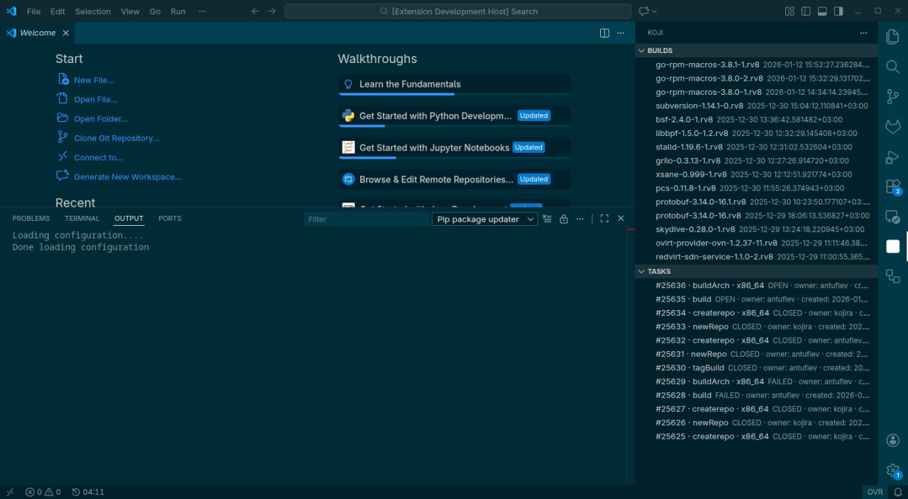

## Koji Tools (VS Code Extension)

Расширение для VS Code для просмотра Koji: крайних сборок, списка тасок и логов по таске.



### Возможности

- **Авторизация**: имя пользователя в настройках, пароль хранится в **VS Code Secret Storage** (`Koji: Set Password`).
- **SSL сертификаты (mTLS)**: можно указать CA/client cert/client key для Koji hub и для скачивания логов.
- **Builds**: TreeView с последними сборками (`listBuilds`).
- **Tasks**: TreeView с последними тасками (`listTasks`) + фильтры по owner/state.
- **Логи таски**: команда `Koji: Open Task Log` открывает `task.log/root.log/build.log/...` как виртуальный документ.

### Настройки

- `koji.hubUrl` — XML-RPC endpoint (по умолчанию Fedora Koji).
- `koji.webUrl` — базовый URL web UI.
- `koji.filesUrl` — базовый URL `kojifiles` (для логов).
- `koji.username` — username.
- `koji.builds.limit` — сколько сборок показывать.
- `koji.tasks.limit` — сколько тасок показывать.
- `koji.tasks.owner` — фильтр по owner.
- `koji.tasks.state` — фильтр состояния.
- `koji.ssl.caFile` — путь к CA bundle (PEM), опционально.
- `koji.ssl.certFile` — путь к client certificate (PEM), опционально.
- `koji.ssl.keyFile` — путь к client private key (PEM), опционально.
- `koji.ssl.rejectUnauthorized` — проверять TLS сертификаты (выключать только для тестов).

### Команды

- `Koji: Set Password`
- `Koji: Clear Password`
- `Koji: Set TLS Key Passphrase`
- `Koji: Clear TLS Key Passphrase`
- `Koji: Refresh Builds`
- `Koji: Refresh Tasks`
- `Koji: Open Task Log`

### Разработка

```bash
npm install
npm run compile
npm test
```


